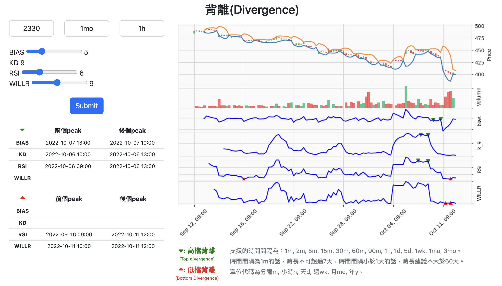

## 用django來建立簡單程式計算台股的高低檔背離

股票歷史資料來源：yahoo finance  
若想查詢的台股資料並未包含在yahoo finance資料庫中，將無法使用  

### 安裝
```
$ git clone https://github.com/voho0000/django_stock_ta.git
$ cd django_stock_ta
$ pip install -r requirements.txt
```
ta-lib使用pip install可能會失敗  
ta-lib建議使用conda安裝或者是到[ta-lib]（https://www.lfd.uci.edu/~gohlke/pythonlibs/#ta-lib）安裝  
`$ conda install -c conda-forge ta-lib`


### 跑程式
`$ python manage.py runserver`

### 畫面
在瀏覽器上輸入localhost:8000 (或所在的port上)，就會出現以下畫面。  

#### 操作1：輸入股票代碼、時間區間跟間隔
1. 股票代碼（code)
2. 檢視的時間區間(period)：數字+單位，例如一個月為1mo   
(時間單位代碼為分鐘m, 小時h, 天d, 週wk, 月mo, 年y)
3. 間隔(interval)：看要__線，數字+單位，如5分鐘線就是5m，月線就是1mo，時間單位代碼同上。
#### 操作2：拖移指數參數
BIAS, RSI, WILLR威廉 這三個指數可藉由拖移來改變參數，KD只計算K值參數且固定為9，無法更改。  
#### 操作3：送出
上述皆輸入好後，點submit，待計算好後，圖會顯示在右側，  
高低檔背離的兩個peak的對應時間列在左下角。  